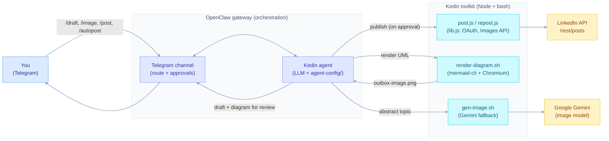

# Kedin — a LinkedIn ghost‑writer AI agent (public demo)

**Kedin is an AI agent you manage from Telegram.** You DM it a topic (or just let its daily job run); it
ghost‑writes a LinkedIn post in your voice, generates a clean **UML / architecture diagram** to go with
it, sends both back to your Telegram chat for review, and — only after **you approve** — publishes to
your LinkedIn feed.

It is **orchestrated by [OpenClaw](https://openclaw.ai)**: OpenClaw hosts the agent, routes your Telegram
messages to it, runs the LLM, and enforces the approval/permission model. Kedin itself is the persona
(`agent-config/`) plus a small toolkit (`*.js` / `*.sh`) that talks to the LinkedIn API and renders the
diagrams.

This is a **public, sanitized, dummy‑data** version of a private agent. It's a sibling of a **digital
twin career agent** — the same core idea (an agent that represents a person's professional identity
online), but with every real credential, path, and personal detail stripped out and replaced with a
**fictional developer persona ("Sam Carter")**. Bring your own credentials and profile and it's yours.

> ⚠️ Everything in `agent-config/USER.md` is fake. Replace it with your real profile before posting.

---

## What it does

- **Drafts** posts in your voice from a rotating topic pool, grounded in your profile (`USER.md`) and an
  evolving style guide (`feedback-dataset.md`) — no emojis, no hype, ~70–130 words.
- **Illustrates** each post with a crisp, legible, colored **Mermaid** diagram (flowchart / sequence /
  class / state / ER), rendered to PNG. Falls back to a Google **Gemini** diffusion image for abstract
  topics.
- **Reviews before publishing**: in `review` mode it sends you the draft + diagram and waits; in
  `autonomous` mode it posts directly. You teach it your voice with `/feedback`.
- **Publishes** to LinkedIn via the official `/rest/posts` API (text or text+image), and can reshare,
  edit, or delete posts.

## Architecture

You drive Kedin from **Telegram**; **OpenClaw** orchestrates the agent and brokers every external call.



**Flow:** you DM a command → OpenClaw routes it to the Kedin agent → the agent drafts the post and a
Mermaid diagram → both come back to your Telegram for review → on `/post`, the toolkit publishes to
LinkedIn. The **toolkit** is plain Node stdlib + bash and also runs standalone for the LinkedIn and
diagram parts; the **persona/behavior** lives in `agent-config/` and runs inside the OpenClaw gateway.

## Repository layout

```
kedin/
├─ lib.js                 # shared: OAuth/refresh, HTTPS, Images API upload, emoji/Unicode sanitize
├─ oauth.js               # one-time LinkedIn OAuth (url / exchange <code>) → stores token + member URN
├─ post.js / post.sh      # publish outbox.md (text or --image); --dry-run builds the request, posts nothing
├─ repost.js / repost.sh  # reshare a post with your commentary
├─ delete.js / editpost.js (+ .sh)  # delete / edit a published post
├─ gen-image.js / gen-image.sh      # Gemini diffusion image (house-styled UML look)
├─ render-diagram.sh      # Mermaid source → crisp PNG (via mermaid-cli + Chromium)
├─ mmd-sanitize.js        # auto-repairs common LLM Mermaid mistakes (unquoted labels, etc.)
├─ draft-diagram.sh       # render Mermaid + deliver to chat (diffusion fallback if it won't render)
├─ draft-image.sh         # diffusion image + deliver to chat
├─ send-image.sh          # push a candidate image to your chat (openclaw message send --media)
├─ mermaid-puppeteer.json # Chromium path + flags for mermaid-cli
├─ agent-config/          # the agent's persona/behavior (IDENTITY, AGENTS, COMMANDS, SKILL, USER, …)
├─ .env.example           # all configuration (copy to .env)
└─ credentials/           # gitignored; *.example.json shows the schema
```

## Prerequisites

- **Node.js** ≥ 18 (the toolkit uses only the standard library — no `npm install` for the core).
- For diagrams: **`@mermaid-js/mermaid-cli`** and a **Chromium** binary.
  ```bash
  npm install -g @mermaid-js/mermaid-cli      # provides `mmdc`
  # point mermaid-puppeteer.json at your chromium (default: /usr/bin/chromium)
  ```
- A **LinkedIn developer app** (for `client_id` / `client_secret` and the `w_member_social` product).
- *(Optional)* a **Google Gemini API key** — only for the diffusion image fallback.
- *(Optional)* an **OpenClaw gateway** — to run Kedin as a chat agent and deliver images to chat.

## Setup

```bash
git clone <your-fork> kedin && cd kedin
cp .env.example .env                      # then edit .env with your values
cp credentials/linkedin/kedin.example.json credentials/linkedin/kedin.json
#   → fill in client_id + client_secret from your LinkedIn app

set -a && . ./.env && set +a              # load env into the shell
node oauth.js url                         # open the URL, approve, copy the ?code=…
node oauth.js exchange <code>             # stores access_token + your member URN

# try it (no posting):
echo "Hello from Kedin." > workspace/outbox.md
node post.js --dry-run workspace/outbox.md   # prints the request it WOULD send

# render a diagram:
printf 'flowchart LR\n A["API"] --> B["Worker"]\n' > workspace/outbox-diagram.mmd
./render-diagram.sh                          # → workspace/outbox-image.png
```

Finally, customize **`agent-config/USER.md`** (your real profile) and **`autopost-topics.md`** (your
topics), then run Kedin inside OpenClaw and talk to it: `/draft`, `/image`, `/post`, `/autopost`, …
(see `agent-config/COMMANDS.md`).

## Security notes

- **No secrets in this repo.** Credentials, tokens, and the member URN load at runtime from
  `credentials/` (gitignored) — never hardcoded. `.env` and `credentials/` are excluded by `.gitignore`;
  only `*.example.json` schemas are tracked.
- **Dummy identity.** `USER.md` and `kedin.example.json` are fictional placeholders. Swap in your own.
- **Approval‑gated by default.** `review` mode never publishes without your explicit `/post`.
- **Least‑privilege chat send.** Images are staged into an allowed media dir before delivery (OpenClaw
  blocks sending files straight out of agent workspace dirs).
- Keep your fork **private** if you put your real `USER.md`/profile in it.

## Credits

Inspired by the "digital twin" career‑agent pattern — an agent that speaks for a person's professional
self online. This public edition keeps the engineering and throws away the identity. Diagrams by
[Mermaid](https://mermaid.js.org/); image fallback by Google Gemini; runs on
[OpenClaw](https://openclaw.ai).
